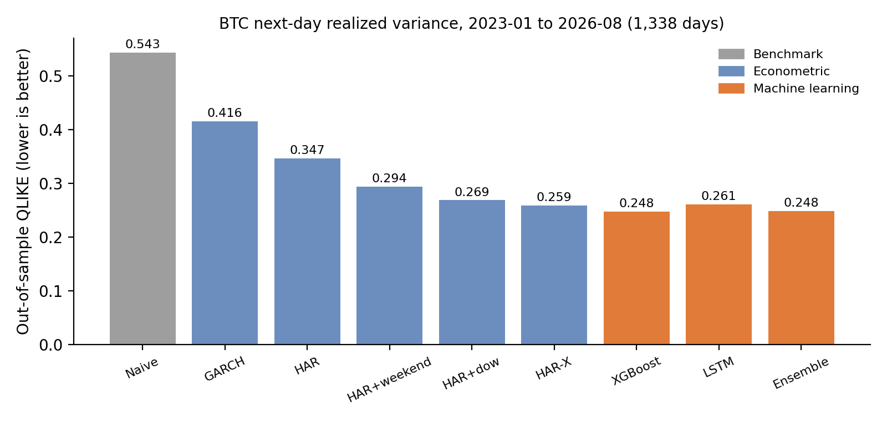
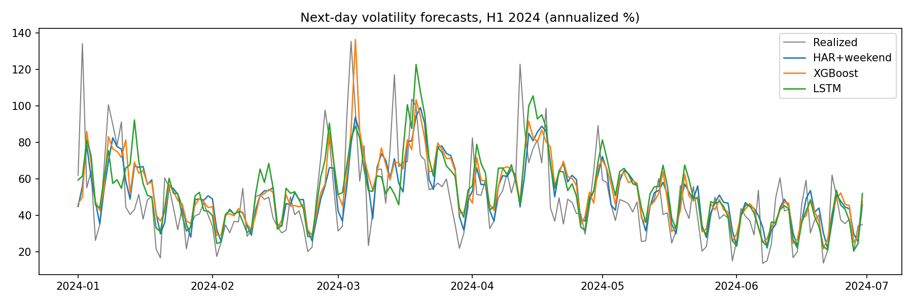

# Forecasting Bitcoin Realized Volatility: Econometrics vs Machine Learning

Next-day realized variance forecasting for BTC/USDT, built from 5-minute Binance data (2019–2026).
Classical models (GARCH, HAR) are compared with XGBoost and an LSTM in a strict rolling
out-of-sample setting, with Diebold–Mariano tests on the QLIKE loss.

**Key finding.** ML models cut the QLIKE loss by ~16% relative to a HAR benchmark with a weekend dummy,
but a *linear* HAR fed with the same inputs is statistically indistinguishable from XGBoost
(DM p = 0.73). The gain comes from feature engineering, mainly intraweek seasonality, not from non-linearity.

📄 Full write-up with the mathematics: [`report/report.pdf`](report/report.pdf)



## Data

- Source: Binance public spot klines, BTC/USDT, 5-minute bars (`data.binance.vision`, no API key)
- Period: January 2019 – August 2026, about 2,790 complete days (days with < 90% of bars are dropped)
- Daily realized variance: $RV_t = \sum_{i=1}^{288} r_{t,i}^2$, where $r_{t,i}$ are 5-minute log-returns; the target is $\log RV_{t+1}$

## Stylized facts (step 2)

- $RV$ is extremely skewed (skewness ≈ 21); $\log RV$ is close to Gaussian (skewness ≈ 0.13), so models work in logs
- Daily returns are nearly unpredictable (ACF at lag 1 ≈ −0.07)
- $\log RV$ has long memory (ACF ≈ 0.70 at lag 1, still ≈ 0.27 at lag 30)
- Strong weekly seasonality: volatility drops on weekends, when traditional markets are closed

## Models

| Model | Description |
|---|---|
| Naive | $RV_{t+1} = RV_t$ |
| GARCH(1,1) | Daily returns, Student-t innovations |
| HAR | $\log RV_{t+1}$ regressed on daily, weekly (7 d) and monthly (30 d) averages of $\log RV$ (Corsi, 2009) |
| HAR+weekend | HAR plus a dummy for "tomorrow is Saturday or Sunday" |
| HAR+dow | HAR plus one dummy per day of the week |
| HAR-X | Linear regression on the full ML feature set |
| XGBoost | Gradient-boosted trees on 7 lags of $\log RV$, HAR averages, vol-of-vol, returns (incl. negative part), day of week |
| LSTM | One-layer LSTM (32 units) on 30-day sequences of the same features |
| Ensemble | Equal-weight average of HAR+weekend, XGBoost and LSTM |

Log forecasts are mapped back to variance with the log-normal correction $\widehat{RV} = \exp(\hat\mu + \hat\sigma^2/2)$.

## Protocol (no look-ahead)

- Out-of-sample period: 2023-01-01 → 2026-08-30 (1,338 days)
- Rolling 1,000-day training window; HAR models refit daily, GARCH every 20 days, ML models every 60 days
- ML early stopping and residual variance estimated on the last 200 days of each window
- Metrics: QLIKE (primary, robust to noise in the RV proxy; Patton, 2011), MSE, MSE on logs
- Significance: Diebold–Mariano test with Newey–West variance (5 lags)

## Results

| Model | QLIKE | vs Naive | MSE log | DM t vs HAR+weekend | p-value |
|---|---:|---:|---:|---:|---:|
| Naive | 0.5433 | – | 0.7916 | +8.71 | <0.001 |
| GARCH(1,1) | 0.4159 | −23% | 1.0444 | +4.16 | <0.001 |
| HAR | 0.3466 | −36% | 0.6597 | +5.58 | <0.001 |
| HAR+weekend | 0.2943 | −46% | 0.4751 | – | – |
| HAR+dow | 0.2688 | −51% | 0.3969 | −3.83 | <0.001 |
| HAR-X | 0.2586 | −52% | **0.3777** | −4.67 | <0.001 |
| XGBoost | **0.2477** | **−54%** | 0.4578 | −1.40 | 0.161 |
| LSTM | 0.2606 | −52% | 0.4286 | −1.16 | 0.245 |
| Ensemble | 0.2485 | −54% | 0.4342 | −1.90 | 0.057 |

DM t < 0 means the model beats HAR+weekend. Against XGBoost, neither HAR-X (p = 0.73) nor HAR+dow (p = 0.57) is significantly different.

**In-sample HAR+weekend** (full sample): daily 0.34, weekly 0.48, monthly 0.09, weekend −0.62 (t = −21), R² = 0.62.
The weekend coefficient implies about 46% lower variance (≈ 27% lower volatility) on Saturdays and Sundays.

**Takeaways**

1. Intraday realized variance plus a simple HAR structure beats GARCH on daily returns by a wide margin.
2. Calendar effects matter: modeling each weekday separately is the single largest improvement.
3. XGBoost's top features are `weekend`, `dow_next`, `weekly` and `lag6` (same weekday one week earlier). Once a linear model gets the same inputs, the ML advantage is no longer significant.



## Reproduce

```bash
git clone https://github.com/ayoubguenbib/btc-volatility-forecasting.git
cd btc-volatility-forecasting
pip install -r requirements.txt
python src/01_data.py        # download + realized variance (~5 min)
python src/02_explore.py     # stylized facts
python src/03_baselines.py   # Naive, GARCH, HAR, HAR+weekend
python src/04_ml.py          # XGBoost, LSTM, ensemble (~5-10 min on CPU)
python src/05_harx.py        # robustness: HAR+dow, HAR-X
```

Figures and result tables are written to `results/`; raw data and forecasts to `data/` (git-ignored).

## Limitations and extensions

Single asset and single (1-day) horizon; fixed ML hyperparameters; 5-minute sampling ignores microstructure noise corrections.
Natural next steps: multi-horizon forecasts (1, 5, 22 days), ETH and other assets, HAR-J / HARQ extensions,
and a Model Confidence Set (Hansen, Lunde & Nason, 2011) instead of pairwise tests.

## Author

Ayoub Guenbib, École Polytechnique (X2025), applied mathematics.
